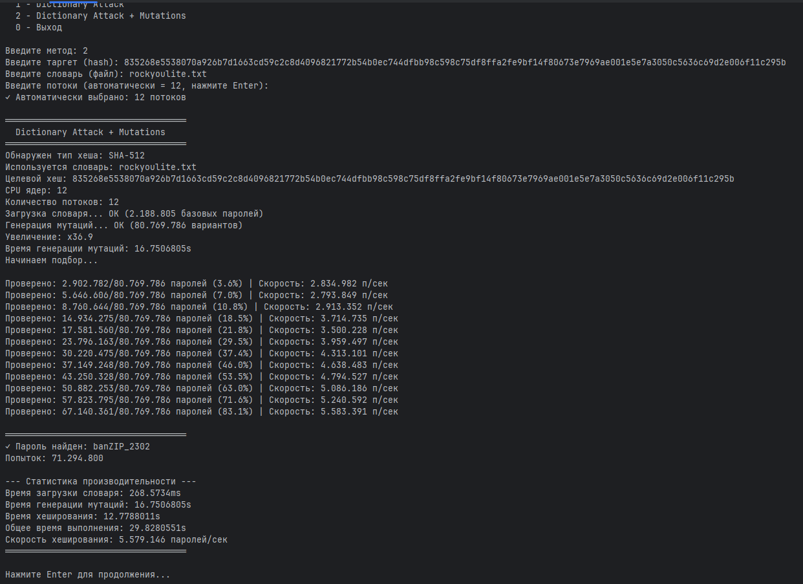

# Hash Cracker v1.0

Высокопроизводительный инструмент для восстановления паролей из криптографических хешей на Go с поддержкой параллельной обработки.

## ⚠️ Дисклеймер

**Только для легального использования**: восстановление собственных паролей, тестирование безопасности с разрешения владельца, образовательные цели. Использование для несанкционированного доступа незаконно.

## 🚀 Возможности

- **Словарные атаки** — обработка словарей до 2M+ паролей
- **Автоматические мутации** — генерация до 35 вариантов на каждый пароль
- **Параллельная обработка** — использование всех ядер CPU через горутины
- **4 алгоритма** — MD5, SHA-1, SHA-256, SHA-512
- **Высокая скорость** — до 5.6M паролей/сек (SHA-512)

## 🛠️ Установка

- **git clone [https://github.com/redusers/hash-cracker.git](https://github.com/porgnope/hash-cracker)**
- **cd hash-cracker**
-  **go build -o hash_cracker**

## 🔧 Технологии

**Почему Go, а не Python?**

- **Горутины** — легковесные (2KB vs 1-2MB потоков Python)
- **Нет GIL** — параллелизм на всех ядрах
- **Нативная компиляция** — прямое исполнение машинного кода
- **Результат**: в 3-5 раз быстрее Python с multiprocessing

## 📋 Требования

- Go 1.16+
- 512 MB RAM (рекомендуется 2+ GB)
- Многоядерный CPU (оптимизировано для параллелизма)

## 📜 Лицензия

MIT License — свободное использование с указанием авторства.

---

**Разработано для демонстрации возможностей Go и параллельного программирования**

